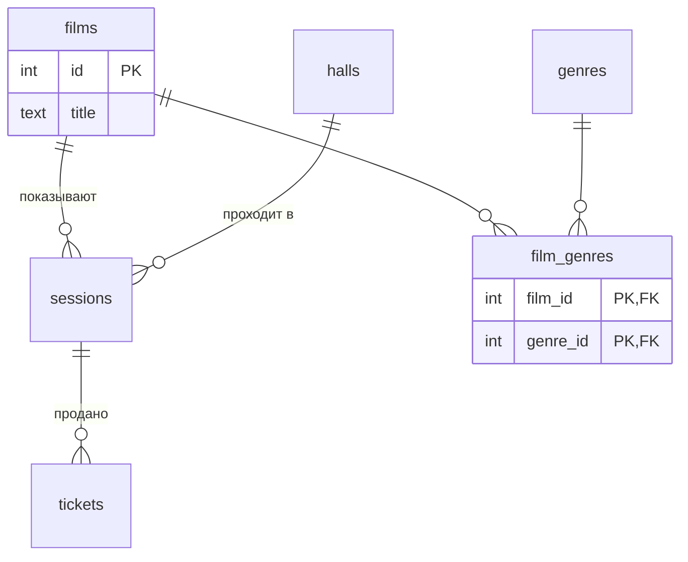

<!--
  Это шаблон. После создания своего репозитория:
  1. Назовите репозиторий db-<фамилия>-<тема>, например db-ivanova-cinema.
  2. Заполните разделы ниже под свою тему и удалите этот комментарий.
-->

# Название проекта

Тема № __: **...**. Одно предложение: какие данные хранит база и кому они нужны.

| | |
| --- | --- |
| Главная таблица | ... |
| Связь N:M | ... и ... через `...` |
| Бизнес-правило | ... |
| СУБД | PostgreSQL 17 в Docker |

## Задания курса

Правила курса, установка и порядок сдачи: [docs/README.md](docs/README.md).

| Лаба | Задание |
| --- | --- |
| 1. Модель данных и схема | [docs/lab-1.md](docs/lab-1.md) |
| 2. Запросы | [docs/lab-2.md](docs/lab-2.md) |
| 3. Логика в базе | [docs/lab-3.md](docs/lab-3.md) |
| 4. Транзакции и доступ | [docs/lab-4.md](docs/lab-4.md) |
| 5. Производительность | [docs/lab-5.md](docs/lab-5.md) |
| Витрина к защите | [docs/showcase.md](docs/showcase.md) |

## Как запустить

```bash
cp .env.example .env          # пароли и порт
docker compose up -d          # при первом запуске выполняются скрипты из db/
dbcheck run demo/lab1.sql     # сценарий лабы 1
```

Работа с базой: `docker compose exec db psql -U postgres -d app`. Сценарии выполняются в `psql` командой `\i /demo/lab1.sql`.

После изменения скриптов в `db/` базу нужно пересоздать: `docker compose down -v && docker compose up -d`.

## ER-диаграмма

<!-- Замените пример своими таблицами: 5+ таблиц, связь N:M через связующую таблицу. -->



## Ограничения

| Ограничение | Таблица и колонки | Зачем |
| --- | --- | --- |
| `UNIQUE` | ... | ... |
| `CHECK` | ... | ... |

## Что сделано по лабам

| Лаба | Что сделано | Сценарий |
| --- | --- | --- |
| 1 | ... | `demo/lab1.sql` |
| 2 | ... | `demo/lab2.sql` |
| 3 | ... | `demo/lab3.sql` |
| 4 | ... | `demo/lab4.sql`, `demo/race.sql`, `demo/race_fixed.sql` |
| 5 | ... | `demo/lab5.sql` |

<!--
  Разделы, которые добавляются по ходу курса:
  лаба 1 ★: «Нормализация», «Типы данных»; ★★: «Что происходит при удалении»;
  лаба 4: «Гонка»;
  лаба 5: «Производительность» (таблица до / после, когда индекс не помогает, размеры).
-->
